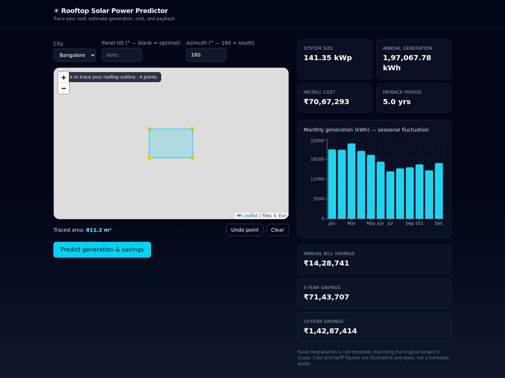

# Rooftop Solar Power Predictor

Trace your rooftop on a satellite map, and get an estimate of how much solar
power it could generate: annual kWh, monthly seasonal fluctuation, install
cost, and 5/10-year electricity bill savings — trained on 5 years of real
historical weather data for Bangalore and Mumbai.



## Background

This is a from-scratch rebuild of a group project originally built during a
2024 internship program under the mentorship of Mr. Isaac Theogaraj (IEEE),
with industry guidance on weather forecasting and renewable energy from
Reconnect Energy. The original implementation was lost; this version keeps
the same core idea — map-based rooftop selection, historical-irradiance-
driven prediction, cost/savings estimation for Bangalore and Mumbai — while
upgrading the stack, the feature set, and the UI.

## How it works

1. **Frontend** (React + TypeScript + Tailwind + Leaflet + Recharts): trace
   your rooftop outline on satellite imagery; the polygon area is computed
   client-side with Turf.js.
2. **Backend** (FastAPI): takes the roof area, city, and optional panel
   tilt/azimuth, and returns generation, cost, and savings estimates.
3. **Model**: a small PyTorch feedforward network predicts specific PV power
   output (W per kWp) from weather features — GHI, DNI, DHI, a derived GTI
   (Global Tilted Irradiance), cloud opacity, temperature, wind, humidity,
   precipitation, albedo, pressure, and cyclical time-of-year/day encodings.
   At request time, the trained model runs live inference over each city's
   "typical weather profile" (a month x hour average built from 5 years of
   historical data), so predictions come from an actual forward pass, not a
   static lookup table — and they respond to the tilt/azimuth the user sets,
   since GTI is re-transposed per request via `pvlib`.
4. **Financials**: installed capacity (kWp) comes from the usable roof area
   and panel efficiency; cost and savings use current illustrative Indian
   residential rates (see `backend/app/config.py`).

## Data & methodology — read this before treating the numbers as authoritative

- **Weather data**: 5 years (2019–2023) of hourly historical weather from
  [NASA POWER](https://power.larc.nasa.gov/) for Bangalore and Mumbai — GHI,
  clear-sky GHI, DNI, DHI, cloud amount, temperature, wind, humidity,
  precipitation, albedo, and surface pressure. (Solcast was the original
  project's data source; NASA POWER was used here since it needs no signup.
  Swapping in a Solcast key is a small, isolated change — see
  `backend/data/README.md`.)
- **GTI**: not a raw NASA POWER field. It's derived from GHI/DNI/DHI via a
  Perez/Hay-Davies sky-diffuse transposition model (`pvlib`), given the
  panel's tilt and azimuth and the sun's position at each timestamp — this
  is standard PV-engineering practice, not a shortcut.
- **Training target**: there is no real installed-system telemetry
  available for this project (a known, honest limitation — see the "Is this
  research-paper-worthy?" discussion this project's build log had). Instead
  of fabricating numbers, the neural net is trained to reproduce NREL's
  PVWatts DC output model (via `pvlib.pvsystem.pvwatts_dc`, with a
  NOCT-based cell-temperature model and PVWatts' standard system-loss
  breakdown) — a trusted, widely-used physical PV simulation. In other
  words, **the model is a learned surrogate for a validated physical
  simulation**, not a fit to invented "ground truth." On a held-out final
  year (2023, unseen during training), it reproduces that simulation with
  R² = 0.9999 (RMSE ≈ 1.6 W/kWp) — which mostly demonstrates the pipeline
  is correct, since the target is a near-deterministic function of a subset
  of its own inputs. The natural next step, if this project continues, is
  replacing the synthetic target with real measured generation from actual
  installed systems.
- **Sanity check**: the simulated annual specific yield lands at
  1,340–1,430 kWh/kWp/year for both cities across all 5 years — squarely in
  the range independently reported for Indian rooftop solar installations.
- **Interesting, non-obvious finding**: averaged over a full year, GTI at a
  fixed south-facing "optimal" (latitude-angle) tilt comes out *slightly
  lower* than GHI for both cities. This runs against the usual mid-latitude
  intuition that tilting toward the sun always helps. At these near-tropical
  latitudes (13–19°N), the sun crosses to northern declinations for part of
  the summer, and the monsoon season's very high diffuse fraction reduces
  the sky-view gain from tilting — so a fixed south tilt doesn't pay off
  the way it would further from the equator. It's worth being upfront about
  this in an interview: it's a genuine result, not a bug.
- **Not modeled**: panel degradation over time (matching the original
  project's scope), real-time weather/live forecasting, shading from
  nearby structures, and non-optimal roof orientations beyond a manual
  tilt/azimuth override.

## Running locally

```bash
# Backend
cd backend
python -m venv .venv && source .venv/bin/activate
pip install -r requirements.txt
python -m scripts.train_model      # trains the model, needs data/*.csv present -- see data/README.md
uvicorn app.main:app --reload --port 8123

# Frontend (separate terminal)
cd frontend
npm install
npm run dev
```

The frontend expects the backend at `http://localhost:8123` (see
`frontend/.env`).

## Project structure

```
backend/
  app/
    ml/              # data prep, feature engineering, pvlib transposition,
                      # PVWatts simulation, PyTorch model, live inference
    routers/predict.py
    config.py         # cities, panel specs, cost/tariff assumptions
  scripts/
    fetch_nasa_power.py
    train_model.py
  data/                # historical CSVs + generated climatology/model inputs
  models/              # trained weights, scaler, metrics
frontend/
  src/
    components/RoofMap.tsx          # Leaflet polygon picker
    components/ResultsDashboard.tsx # charts + summary cards
    App.tsx
```

## What's next (matches the original project's stated roadmap)

- More cities — the model already takes latitude as an input specifically
  so a new city is "fetch weather data, retrain," not an architecture change.
- A more powerful model / more factors, if real generation telemetry
  becomes available to validate against.
- Deployment: frontend on Vercel, backend on Render/Railway.
